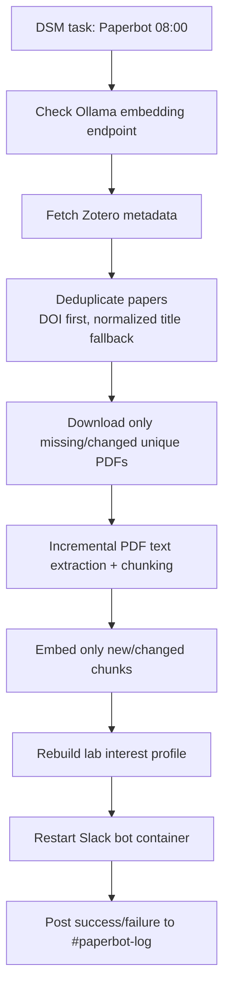

# KohdaLab PaperBot

KohdaLab PaperBot is a private lab knowledge platform for papers. It keeps
Zotero as the source of truth, stores PDFs and a SQLite RAG index on the
Synology NAS, sends heavy LLM and embedding work to the RTX PC, and exposes the
system through Slack.

主な用途は次の4つです。

- Zotero Group Libraryの論文メタデータとPDFをNASへ同期する
- PDF本文をSQLiteへ差分indexingし、Slack DMからRAG検索する
- arXiv / APS / Nature / AIP / nano・2D系の新着論文を監視して`#paper`へ投稿する
- 同期結果と失敗を`#paperbot-log`へ通知する

## Production Architecture

DS920+ is the always-on control plane. The RTX PC only runs Ollama and receives
chat, translation, and embedding requests over the LAN.

```mermaid
flowchart TB
  subgraph sources["Knowledge Sources"]
    direction TB
    zotero["Zotero Group Library\nmetadata + PDF attachments"]
    feeds["New paper feeds\narXiv / APS / Nature / AIP / Crossref"]
  end

  subgraph nas["Synology DS920+ Control Plane\n/volume1/docker/paperbot"]
    direction TB

    subgraph jobs["Scheduled Jobs"]
      sync["Paperbot 08:00 daily\nZotero sync + incremental ingest"]
      watch["Paper Watch weekly/monthly\nrecommend new papers"]
    end

    subgraph app["Runtime Service"]
      bot["paperbot container\nSlack Socket Mode RAG bot"]
    end

    subgraph state["Local Knowledge State"]
      pdfs[("PDF archive\nrag_poc/papers/zotero")]
      db[("SQLite knowledge DB\nchunks.sqlite3")]
      profile["Lab interest profile\nmaterials / methods / physics"]
      logs[("operation logs")]
    end
  end

  subgraph rtx["RTX PC AI Engine\nOllama http://10.32.145.143:11434"]
    direction TB
    embed["Embedding model\nnomic-embed-text"]
    chat["Reasoning / commentary\ngpt-oss:20b"]
    translate["Japanese translation\nqwen3:14b"]
  end

  subgraph slack["Slack Workspace"]
    direction TB
    dm["DM with PaperBot\nRAG Q&A"]
    paper["#paper\nnew paper recommendations"]
    ops["#paperbot-log\nsync success / failure"]
  end

  zotero -->|"metadata + unique PDFs"| sync
  feeds -->|"recent candidates"| watch

  sync --> pdfs
  sync --> db
  sync --> profile
  sync --> logs
  watch --> db
  watch --> logs
  bot --> db

  sync -->|"chunk embeddings"| embed
  bot -->|"query embedding"| embed
  watch -->|"candidate similarity"| embed
  bot -->|"grounded answer"| chat
  watch -->|"technical commentary"| chat
  bot -->|"JA output"| translate
  watch -->|"JA commentary"| translate

  bot <-->|"questions + cited answers"| dm
  watch -->|"one compact post per paper"| paper
  sync -->|"daily status"| ops

  classDef source fill:#fff7ed,stroke:#ea580c,color:#431407
  classDef nas fill:#eff6ff,stroke:#2563eb,color:#172554
  classDef state fill:#f8fafc,stroke:#64748b,color:#0f172a
  classDef rtx fill:#ecfdf5,stroke:#059669,color:#064e3b
  classDef slack fill:#f5f3ff,stroke:#7c3aed,color:#2e1065
  class zotero,feeds source
  class sync,watch,bot nas
  class pdfs,db,profile,logs state
  class embed,chat,translate rtx
  class dm,paper,ops slack
```



More detailed diagrams are in [docs/ARCHITECTURE.md](docs/ARCHITECTURE.md).

The repository stores application code only. Local runtime data is intentionally
ignored by Git:

- `.env`
- `logs/`
- `rag_poc/papers/`
- `rag_poc/index/`

## Current Lab Schedule

These are the intended Synology DSM Task Scheduler entries. The tasks run as
`root`, so the command does not need `sudo` inside DSM.

| DSM task | Timing | Purpose | Command |
| --- | --- | --- | --- |
| `Paperbot` | Every day 08:00 | Zotero metadata/PDF sync, incremental RAG ingest, profile rebuild, Slack status notification | `cd /volume1/docker/paperbot && ./scripts/sync_zotero_pipeline.sh` |
| `Paperbot-arXiv` | Every Monday 09:00 | Weekly arXiv recommendation | `cd /volume1/docker/paperbot && ./scripts/run_paper_watch.sh --sources arxiv` |
| `Paperbot-PR` | First Monday 09:30 | Monthly APS Physical Review watch | `cd /volume1/docker/paperbot && ./scripts/run_paper_watch.sh --sources rss --rss-groups pr,pr_ext` |
| `Paperbot-Nature` | Second Monday 09:30 | Monthly Nature-family watch | `cd /volume1/docker/paperbot && ./scripts/run_paper_watch.sh --sources rss --rss-groups nature,nature_ext` |
| `Paperbot-AIP` | Third Monday 09:30 | Monthly AIP / Applied Physics Letters watch | `cd /volume1/docker/paperbot && ./scripts/run_paper_watch.sh --sources rss --rss-groups aip` |
| `Paperbot-Nano` | Fourth Monday 09:30 | Monthly nano, 2D materials, and broad high-impact watch | `cd /volume1/docker/paperbot && ./scripts/run_paper_watch.sh --sources rss --rss-groups nano_2d,broad_high` |

The staggered monthly jobs keep publisher access conservative and prevent Slack
from receiving all journal alerts on the same morning.

## Deployment

### 1. RTX PC

Install Ollama on the RTX PC and expose it to the LAN.

```bash
ollama pull nomic-embed-text
ollama pull gpt-oss:20b
ollama pull qwen3:14b
```

From DS920+ or another LAN machine, this must return JSON:

```bash
curl http://10.32.145.143:11434/api/tags
```

### 2. DS920+

The production path is:

```bash
/volume1/docker/paperbot
```

Clone or update the repository on the NAS, then create local runtime folders and
the secret environment file.

```bash
cd /volume1/docker
git clone git@github.com-paperbot:Kohdalab/kohdalab-paperbot.git paperbot
cd /volume1/docker/paperbot
mkdir -p rag_poc/papers/zotero rag_poc/index logs
cp .env.example .env
vi .env
```

Required `.env` values:

- `SLACK_BOT_TOKEN`
- `SLACK_APP_TOKEN`
- `OLLAMA_BASE_URL=http://10.32.145.143:11434`
- `OLLAMA_CHAT_MODEL=gpt-oss:20b`
- `PAPERBOT_TRANSLATION_MODEL=qwen3:14b`
- `OLLAMA_EMBED_MODEL=nomic-embed-text`
- `ZOTERO_LIBRARY_TYPE=group`
- `ZOTERO_LIBRARY_ID`
- `ZOTERO_API_KEY`
- `SYNC_NOTIFY_CHANNEL=#paperbot-log`
- `PAPER_WATCH_CHANNEL=#paper`

Start the Slack bot container:

```bash
sudo docker compose -f docker-compose.nas.yml up -d --build paperbot
```

Run the first Zotero/RAG pipeline:

```bash
sudo ./scripts/sync_zotero_pipeline.sh
```

### 3. Slack

PaperBot uses Slack Socket Mode, so the NAS does not need a public webhook URL.

- DM with the bot: ask questions against the RAG index.
- `#paper`: receives Paper Watch recommendations.
- `#paperbot-log`: receives sync success/failure notifications.

Useful bot commands:

- `status` or `状態`: show Ollama, SQLite, Zotero, and index status.
- `sources`: show detailed sources for the previous answer.
- Any paper question: run RAG search and answer with citations.

## Paper Watch

Paper Watch fetches candidates, deduplicates them by DOI or normalized title,
scores them with the lab profile and RAG similarity, and posts compact Slack
messages one paper at a time.

Scoring inputs:

- profile terms from the indexed lab PDFs
- title and abstract term matches
- candidate abstract embedding similarity to the SQLite RAG index
- journal/source group
- duplicate suppression via `seen_papers`

Default source groups:

| Group | Main sources |
| --- | --- |
| `arxiv` | arXiv API |
| `pr` | PRL, PRB, PR Research, PR Applied, PR Materials |
| `pr_ext` | PRX, PRX Quantum, PRX Energy, RMP |
| `nature` | Nature Physics, Nature Communications, Communications Physics |
| `nature_ext` | Nature Materials, Nature Nanotechnology, Nature Photonics, Nature Electronics, Nature Reviews Materials |
| `aip` | Applied Physics Letters and related AIP journals |
| `nano_2d` | Nano Letters, ACS Nano, ACS Photonics, 2D Materials, npj 2D Materials and Applications |
| `broad_high` | Advanced Science, Advanced Materials, Science Advances, PNAS, Cell Reports Physical Science |

Manual dry run:

```bash
sudo ./scripts/run_paper_watch.sh --dry-run --sources arxiv --post-limit 3
```

Post one arXiv paper for testing:

```bash
sudo ./scripts/run_paper_watch.sh --sources arxiv --post-limit 1 --min-score 0
```

Run a journal group without summaries:

```bash
sudo ./scripts/run_paper_watch.sh --dry-run --sources rss --rss-groups nature,nature_ext --no-summary
```

## Zotero Sync and RAG Ingest

The daily pipeline performs:



Incremental behavior:

- Existing Zotero PDFs are skipped unless the attachment changed.
- Duplicate papers are retained in metadata but not downloaded/indexed twice.
- Existing PDF chunks are reused when file hashes are unchanged.
- Zero-text and duplicate PDFs are recorded in `ingest_report.json`.

Important files on the NAS:

| Path | Role |
| --- | --- |
| `/volume1/docker/paperbot/.env` | secrets and runtime configuration |
| `/volume1/docker/paperbot/rag_poc/papers/zotero/` | local Zotero PDF archive |
| `/volume1/docker/paperbot/rag_poc/index/chunks.sqlite3` | metadata, chunks, embeddings, seen papers |
| `/volume1/docker/paperbot/rag_poc/index/lab_profile.md` | generated lab interest profile |
| `/volume1/docker/paperbot/logs/sync_zotero_pipeline.log` | scheduled Zotero/RAG pipeline log |
| `/volume1/docker/paperbot/logs/paper_watch.log` | scheduled Paper Watch log |

## Operations

Update code on DS920+:

```bash
cd /volume1/docker/paperbot
sudo git pull origin master
sudo docker compose -f docker-compose.nas.yml up -d --build paperbot
```

Follow logs:

```bash
sudo tail -f /volume1/docker/paperbot/logs/sync_zotero_pipeline.log
sudo tail -f /volume1/docker/paperbot/logs/paper_watch.log
sudo docker logs -f kohdalab-paperbot
```

Rebuild the whole RAG index only when needed:

```bash
cd /volume1/docker/paperbot
sudo REBUILD=1 ./scripts/sync_zotero_pipeline.sh
```

Check Python files locally or in CI:

```bash
make check
```

## Development Notes

The code is intentionally simple:

- Python application code
- Docker Compose on DS920+
- SQLite as the single local database
- Zotero as the source of truth
- Ollama on RTX PC for local LLM operation
- Slack Socket Mode for user interaction

The project does not commit PDFs, embeddings, logs, or tokens. Public mirrors can
therefore expose the code without exposing the lab paper archive or Slack/Zotero
credentials.

## Release

Current release: `v0.1.0`

See [CHANGELOG.md](CHANGELOG.md) for release notes.

## License

MIT License. See [LICENSE](LICENSE).
