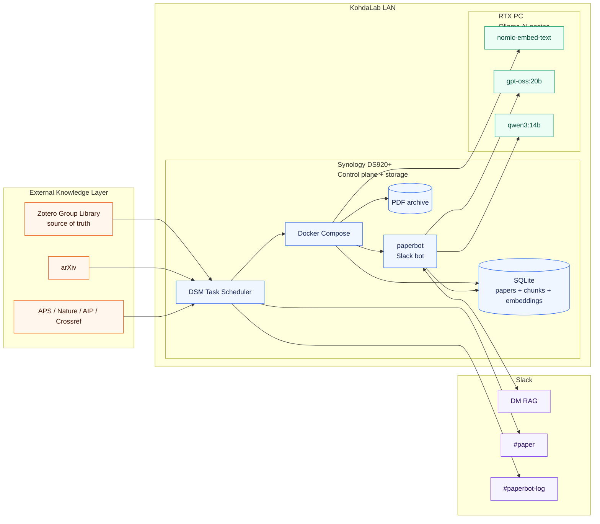
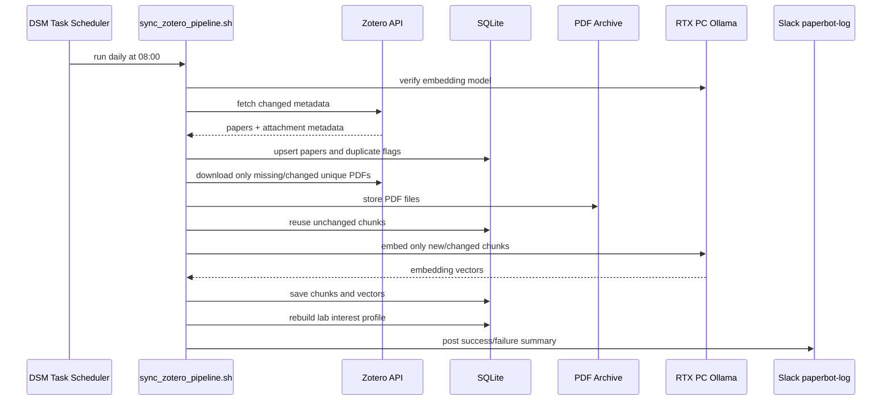
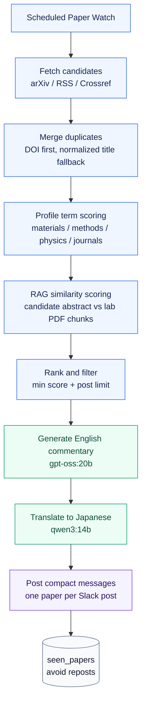
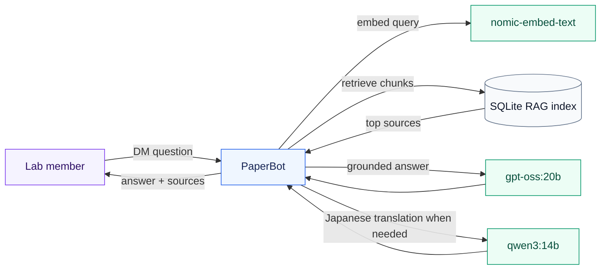

# Architecture

KohdaLab PaperBot is designed as a small lab-scale knowledge platform: the NAS
is the reliable always-on controller, and the RTX PC is the local AI accelerator.

## System Topology

## Daily Knowledge Pipeline

## Paper Watch Flow

## Slack Interaction Flow

## Ownership Boundaries

| Layer | Owner | Stored where | Notes |
| --- | --- | --- | --- |
| Paper metadata | Zotero | Zotero + SQLite mirror | Zotero remains the source of truth |
| PDFs | Zotero / NAS | `rag_poc/papers/zotero/` | Git never stores PDFs |
| RAG index | PaperBot | `rag_poc/index/chunks.sqlite3` | Incremental and rebuildable |
| LLM models | Ollama | RTX PC | No model weights on the NAS |
| Slack UI | Slack app | Slack workspace | Socket Mode, no public NAS endpoint |
| Secrets | Lab admin | NAS-local `.env` | Never committed |
