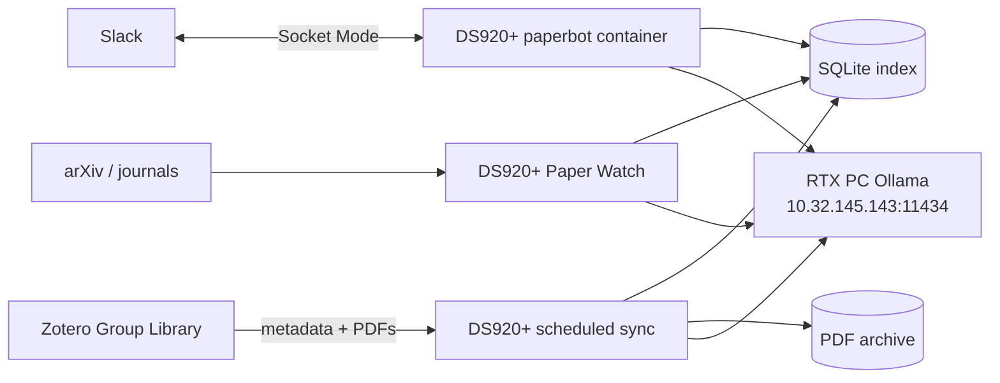

# DS920+ Production Deployment

This document describes the production deployment used by KohdaLab PaperBot.
DS920+ runs the always-on services and scheduled jobs. The RTX PC runs Ollama
for LLM and embedding workloads.

## Roles



| Machine | Responsibility |
| --- | --- |
| Synology DS920+ | Docker Compose, Slack bot, Zotero sync, PDF archive, SQLite, scheduler |
| RTX PC | Ollama models: `nomic-embed-text`, `gpt-oss:20b`, `qwen3:14b` |
| Slack | DM RAG interface, `#paper`, `#paperbot-log` |
| Zotero | Source of truth for paper metadata and attachments |

## 1. RTX PC Checklist

Ollama must be reachable from DS920+:

```bash
curl http://10.32.145.143:11434/api/tags
```

Required models:

```bash
ollama pull nomic-embed-text
ollama pull gpt-oss:20b
ollama pull qwen3:14b
```

## 2. NAS Repository

Production path:

```bash
/volume1/docker/paperbot
```

Initial setup:

```bash
cd /volume1/docker
git clone git@github.com-paperbot:Kohdalab/kohdalab-paperbot.git paperbot
cd /volume1/docker/paperbot
mkdir -p rag_poc/papers/zotero rag_poc/index logs
cp .env.example .env
vi .env
```

Use `.env.example` as the template. Do not commit `.env`.

Minimum required variables:

```bash
SLACK_BOT_TOKEN=xoxb-...
SLACK_APP_TOKEN=xapp-...

OLLAMA_BASE_URL=http://10.32.145.143:11434
OLLAMA_CHAT_MODEL=gpt-oss:20b
OLLAMA_EMBED_MODEL=nomic-embed-text
PAPERBOT_TRANSLATION_MODEL=qwen3:14b
PAPERBOT_TRANSLATION_ENABLED=true

ZOTERO_LIBRARY_TYPE=group
ZOTERO_LIBRARY_ID=...
ZOTERO_API_KEY=...

SYNC_NOTIFY_CHANNEL=#paperbot-log
SYNC_NOTIFY_MODE=verbose

PAPER_WATCH_CHANNEL=#paper
PAPER_WATCH_SUMMARY_MODEL=gpt-oss:20b
PAPER_WATCH_TRANSLATION_MODEL=qwen3:14b
PAPER_WATCH_TRANSLATION_ENABLED=true
```

## 3. Start PaperBot

```bash
cd /volume1/docker/paperbot
sudo docker compose -f docker-compose.nas.yml up -d --build paperbot
```

Check:

```bash
sudo docker ps
sudo docker logs -f kohdalab-paperbot
```

In Slack DM, send:

```text
status
```

## 4. First Sync

Run the full pipeline manually once:

```bash
cd /volume1/docker/paperbot
sudo ./scripts/sync_zotero_pipeline.sh
```

The pipeline:

1. checks Ollama embedding connectivity
2. fetches Zotero metadata
3. downloads only missing or changed unique PDFs
4. incrementally indexes changed PDFs into SQLite
5. rebuilds the lab interest profile
6. restarts the Slack bot
7. posts success or failure to `#paperbot-log`

## 5. DSM Task Scheduler

Create the tasks in DSM Control Panel > Task Scheduler. Use `root` as the owner.

| Task | Schedule | Command |
| --- | --- | --- |
| `Paperbot` | Daily 08:00 | `cd /volume1/docker/paperbot && ./scripts/sync_zotero_pipeline.sh` |
| `Paperbot-arXiv` | Every Monday 09:00 | `cd /volume1/docker/paperbot && ./scripts/run_paper_watch.sh --sources arxiv` |
| `Paperbot-PR` | First Monday 09:30 | `cd /volume1/docker/paperbot && ./scripts/run_paper_watch.sh --sources rss --rss-groups pr,pr_ext` |
| `Paperbot-Nature` | Second Monday 09:30 | `cd /volume1/docker/paperbot && ./scripts/run_paper_watch.sh --sources rss --rss-groups nature,nature_ext` |
| `Paperbot-AIP` | Third Monday 09:30 | `cd /volume1/docker/paperbot && ./scripts/run_paper_watch.sh --sources rss --rss-groups aip` |
| `Paperbot-Japan` | Third Monday 10:00 | `cd /volume1/docker/paperbot && ./scripts/run_paper_watch.sh --sources rss --rss-groups japan,iop_semiconductor,optics` |
| `Paperbot-Nano` | Fourth Monday 09:30 | `cd /volume1/docker/paperbot && ./scripts/run_paper_watch.sh --sources rss --rss-groups nano_2d,broad_high` |

The weekly/monthly split keeps publisher access light and makes Slack posts
easier to read. Paper Watch posts one Slack message per selected paper. If a
run selects five papers, Slack should receive five separate messages.

Journal groups are intentionally broad but rate-limited:

| Group | Main sources |
| --- | --- |
| `pr` / `pr_ext` | Physical Review family |
| `nature` / `nature_ext` | Nature Physics, Nature Communications, Communications Physics, and related Nature journals |
| `aip` | Applied Physics Letters, Journal of Applied Physics, APL Materials, Applied Physics Reviews, AIP Advances |
| `japan` | JJAP, Applied Physics Express, JPSJ, STAM, NPG Asia Materials |
| `iop_semiconductor` | Semiconductor Science and Technology, Journal of Physics D |
| `optics` | Laser & Photonics Reviews, Optics Letters |
| `nano_2d` | Nano Letters, ACS Nano, ACS Photonics, 2D Materials, npj 2D Materials and Applications |
| `broad_high` | Advanced Science, Advanced Materials, Science Advances, PNAS, Cell Reports Physical Science |

The default access policy is conservative: arXiv uses a submitted-date window,
Crossref requests include `mailto`, rows are capped per request, and journal
jobs are staggered by week.

## 6. Manual Paper Watch

Dry run arXiv:

```bash
cd /volume1/docker/paperbot
sudo ./scripts/run_paper_watch.sh --dry-run --sources arxiv --post-limit 3
```

Post one test paper:

```bash
sudo ./scripts/run_paper_watch.sh --sources arxiv --post-limit 1 --min-score 0
```

Dry run a journal group:

```bash
sudo ./scripts/run_paper_watch.sh --dry-run --sources rss --rss-groups pr,pr_ext --no-summary
```

Dry run the Japanese/applied physics group:

```bash
sudo ./scripts/run_paper_watch.sh --dry-run --sources rss --rss-groups japan,iop_semiconductor,optics --no-summary
```

Inspect the current Zotero journal distribution in the NAS SQLite database:

```bash
sudo docker compose -f docker-compose.nas.yml run --rm paperbot \
  python - <<'PY'
import sqlite3

conn = sqlite3.connect('/app/rag_poc/index/chunks.sqlite3')
for row in conn.execute("""
    SELECT COALESCE(NULLIF(journal, ''), '(unknown)') AS journal, COUNT(*) AS n
    FROM unique_papers
    GROUP BY journal
    ORDER BY n DESC
    LIMIT 50
"""):
    print(f"{row[1]:4d}  {row[0]}")
PY
```

## 7. Logs

Scheduled logs are stored on the NAS:

```bash
sudo tail -f /volume1/docker/paperbot/logs/sync_zotero_pipeline.log
sudo tail -f /volume1/docker/paperbot/logs/paper_watch.log
sudo docker logs -f kohdalab-paperbot
```

If a DSM scheduled task does not write logs, check that the task command uses the
repository path and script directly:

```bash
cd /volume1/docker/paperbot && ./scripts/sync_zotero_pipeline.sh
```

## 8. Updating

```bash
cd /volume1/docker/paperbot
sudo git pull origin master
sudo docker compose -f docker-compose.nas.yml up -d --build paperbot
```

`docker-compose.nas.yml` uses a shared `kohdalab-paperbot:local` image for all
services. The scheduled scripts quietly rebuild that image before one-off jobs
by default, which prevents `paper-watch` from using an old image after code
changes. Set `COMPOSE_RUN_BUILD=0` only for troubleshooting.

If the RAG schema or chunking changed:

```bash
sudo REBUILD=1 ./scripts/sync_zotero_pipeline.sh
```

## 9. Runtime Data

Do not commit runtime data.

| Path | Description |
| --- | --- |
| `.env` | Slack, Zotero, and runtime secrets |
| `rag_poc/papers/zotero/` | downloaded Zotero PDFs |
| `rag_poc/index/chunks.sqlite3` | SQLite RAG database |
| `rag_poc/index/lab_profile.md` | generated interest profile |
| `logs/` | sync and Paper Watch logs |

## 10. Troubleshooting

`permission denied while trying to connect to the Docker daemon socket`

Run manually with `sudo`, or run DSM tasks as `root`.

`Ollama connection failed`

Check the RTX PC is awake and reachable:

```bash
curl http://10.32.145.143:11434/api/tags
```

`embed=nomic-embed-text missing`

Pull the embedding model on the RTX PC:

```bash
ollama pull nomic-embed-text
```

`RSS feed skipped: HTTP 403`

Some publishers block RSS user agents. PaperBot uses conservative Crossref
fallbacks where configured. Keep monthly journal watches staggered.
